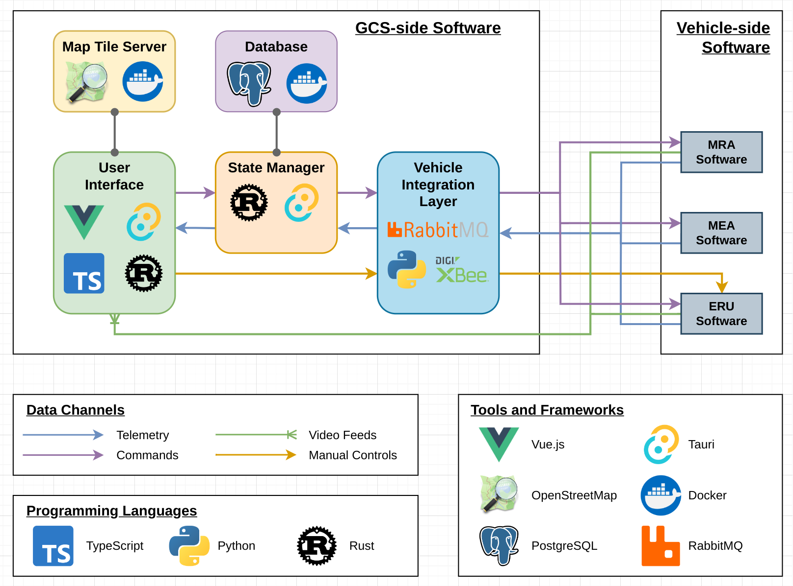

# Choosing a Database
The decision to migrate to a new database came from needing a more defined structure of how the data was being stored within the database. 
In order to meet the RFP of our year, we chose to stress test multiple database candidates under this [repo](https://github.com/ngcp-project/database-trade-study)
The candidates were Influx DB, MongoDB, Cassandra, and PostGreSQL.
Documentation was listed within the ReadME of each branch containing details on how the developer experience was, and the read/write speed in C#.
Overall, all candidates handedly beat the RFP requirement of 1 update per second. Not enough criterias were considered to be written down and analyzed as a trade matrix.
Due to having the fastest read/write speed and relative easy of developer support, PostGreSQL was used for the 2024-25 codebase.

# Use of a State Manager
The use of an upgraded state manager was born out of the need of the UI's team for better support in state management. 
The built-in UI's state manager was not enough to support the use of two instances of the UI for dual screens, so a replacement had to be made.

## State Manager Architecture
The state manager is written in Rust, which is directly supported by Tauri, the main framework to build the UI desktop app.
[Tarpc](https://github.com/google/tarpc) was the main library used to interact with Tauri's API, an events-based architecture.
Events are similar to REST APIs except no HTTP server is used. Instead, an event is invoked on the frontend, which gets called on the Rust side and executed, emitting a response back to the frontend.

Invoke event (Frontend) => Execute on Rust side (pseudo-backend) => Emit response to Frontend (pseudo-backend)

Events also allow to listen for state changes in Rust, notifying the UI of any value changes in the state variable stored in Rust. 
Tarpc was also used to generate the TypeScript types in the Frontend, ensuring type safety.
