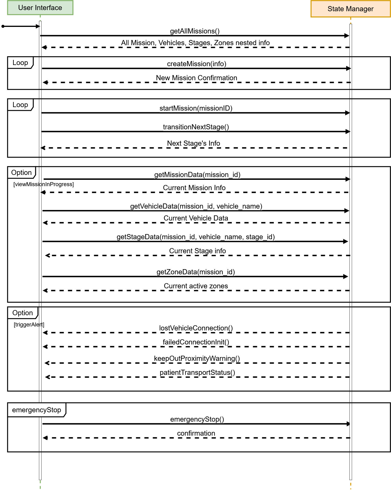

## Key Assumptions Made
- Only one mission can be active at a time. If there is a currently active mission and the operator (user) starts another mission, the currently active mission will be set to complete and the new mission will be set to active.
- Mission Structure: Mission => Vehicles => Stages
  - Zones are global to each mission. Every vehicle within that mission will share the same Keep In / Keep Out zones.
- By default, every mission will have all NGCP vehicles associated with them: MRA (CPP's UAV), ERU (CPP's UGV), and MEA (SLO's UAV). However, not every vehicle is part of the mission. This is notated by whether a vehicle has a stage attached to them or not. If a vehicle has a stage initialized, they are part of the mission.
- When transitioning to another stage, the previous stage is marked as complete. The next stage is marked as active.
- Mission, Stage, and Vehicle state tracking (CRUD operations) are done with IDs generated by the PostGresSQL database. Any operation related to these rely on searching for the appropriate entry by ID.
- Once a mission has been started, no additional edits can be made.

## Sequence Diagram
This sequence diagram, displayed during PDR, generally outlines the general sequence of commands in the order executed (read top-down).

## Function documentation and purpose

### new()
- Stage manager initialization. It sets up the initial state of the mission with values from the database.

### create_default_stage(stage_name, vehicle_id)
- Creates a default stage placeholder for the mission. Information will be replaced with the actual stage information when inputted by the UI.

### create_default_mission(mission_name)
- Creates a default mission placeholder. Information will be replaced with the actual mission information when inputted by the UI.

### rename_mission(mission_id, mission_name)
- Renames the mission. Mission Name is supplied by the UI.

### create_mission(mission_name)
- Creates a new mission. A mission placeholder will be initialized both in the database and the Rust State Manager using the create_default_mission() function.

### delete_mission(mission_id)
- Deletes the mission. The mission is removed from the database and the Rust State Manager, along with all associated stages and vehicles.

### set_auto_mode(mission_id, vehicle_name, is_auto)
- Toggles a specific vehicle into manual / automatic control.

### add_stage(mission_id, vehicle_name, stage_name)
- Adds a new stage to the mission. A stage placeholder will be initialized both in the database and the Rust State Manager using the create_default_mission() function.

### delete_stage(mission_id, vehicle_name, stage_id)
- Deletes the stage from the mission. This is used when the user wants to delete a stage from the mission. The stage is removed from the database and all associated vehicles and zones are also removed.

### rename_stage(mission_id, vehicle_name, stage_id, stage_name)
- Renames the stage. Stage Name is supplied by the UI.

### transition_stage(mission_id, vehicle_name)
- Transitions the stage. The current stage is marked as complete and the next stage is marked as active.

### add_zone(mission_name, zone_type)
- Adds a new zone to the stage. This is used when the user wants to add a new zone to the stage. The zone is created with a default vehicle and a default stage.

### delete_zone(mission_name, zone_type, zone_index)
- Deletes the zone from the stage. This is used when the user wants to delete a zone from the stage. The zone is removed from the database and all associated vehicles and stages are also removed.

