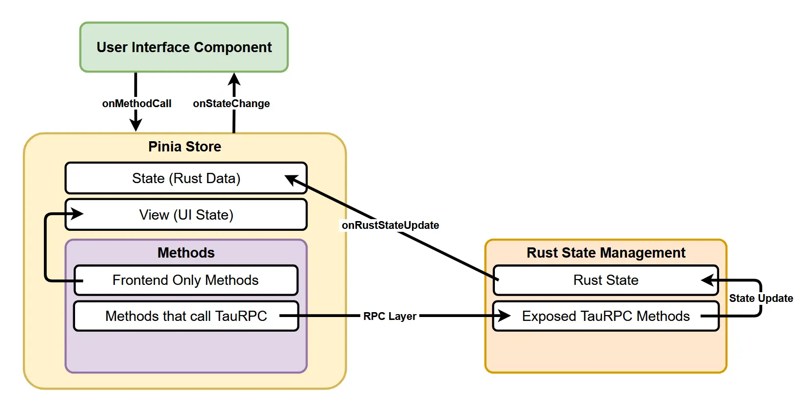
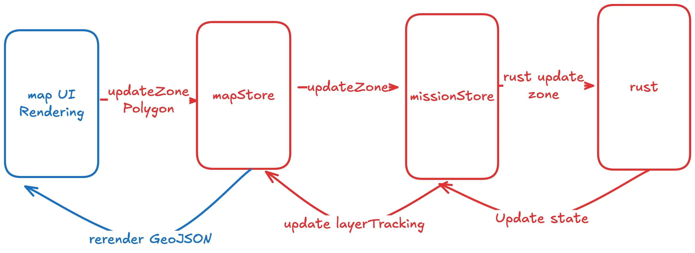

**Pinia** is a state management library used as our solution to synchronizing states between the backend (TauRPC & RabbitMQ) and the frontend (Vue). Everything discussed in the following sections will be primarily focused on the frontend side.

Currently, we are using this for [Map](../map-frontend), [Mission](../mission-frontend), and [Telemetry](../telemetry-frontend).

The following diagram provides an overview of how state management works on the frontend.


## How it Works

To use Pinia, we must first mount **app** with a **Pinia instance** in `main.ts` and before we can define **stores**:
```typescript
//src/main.ts
import { createApp } from "vue";
import "./main.css";
import App from "./App.vue";
import router from "./router";
import { createPinia } from 'pinia'

createApp(App).use(router).use(createPinia()).mount("#app");
```


A store is an object that contains the state and methods for the application. This store is a centralized place to store states and logic. Whenever states update in the Tauri Rust backend, the store will also update with the new states. The Vue frontend then can read from these states after the update, ensuring synchronized data between the backend and the frontend.

One thing to note is that stores *can* communicate with each other. If the data-flow of one API is similar or related to another API's, then we can utilize multiple stores to achieve a task. We'll explain this with an example using the Map Store and Mission Store.

For some quick context, we use a map to designate zones for the vehicle's area of operations.



The Map Store is strictly responsible for updating the zones visually, so it is not responsible for updating the data of the zones. To do the latter, we use the methods in the Mission Store to update the zones data to our Rust backend. Hence, there is a layer of abstraction where methods from one store are being called by methods in another store.

## Creating a Store

This guide will assume there is already a backend API set up and a **Pinia instance** mounted to app. At the very least, a `types.rs` file (which you can find under `src-tauri/src/[api name]`).

### Initialization

First, create a store file called `[store name].ts` file under `src/lib`. We'll need to import some dependencies.

```typescript
// src/lib/ExampleStore.ts
import { defineStore } from "pinia"; // #1
import { ref, computed } from "vue"; // #2
import { ExampleState } from "@/lib/bindings.ts"; // #3
```

**#1** is for the defineStore function.

**#2** `ref` for a store's state and `computed` may be used in getter functions.

**#3** is the type for your store's state. Refer to [Typing](#typing).


Right after the imports, we will use the following two lines to initialize the TauRPC proxy and the initial state of our store.

```typescript
// src/lib/ExampleStore.ts
// Create TauRPC proxy
const taurpc = createTauRPCProxy();

// Fetch initial state from backend
const initialState: ExamplesStruct = await taurpc.example.get_all_examples();
```

For initial state, there is usually an exposed function from the backend that will fetch all necessary states for your store/struct. Notice how the `get_all_examples()` function is being accessed via the `taurpc` constant.

Now the store can be created.

```typescript
// src/lib/ExampleStore.ts
export const missionPiniaStore = defineStore("exampleKeyWord", () => {
  const state = ref<ExamplesStruct | null>(initialState);
  const syncRustState = (rustState: ExamplesStruct) => {
    missionState.value = rustState;
  };
  ...
});
```

This part of the store definition will be necessary for the [Backend Listeners](#backend-listeners). The store's state is set directly by modifying the ref's value with the `rustState` object, ensuring synchronization with the backend Rust state. 

### Properties

For the `defineStore()` function, we are passing in the two parameters-- a **string** to act as a key (see "exampleKeyWord" above) and a **function** to define the store's properties. Within the initialization of a store,
`refs` are used as a store's state. In addition, properties of a store must be returned in order to be used by dependencies as shown below.

<!-- <ins> element is for underlining -->
Here are some examples of methods used by our Mission Store. Do note that the actual implementation can heavily vary between stores. <ins>This is simply to give an idea of how some methods work, not a strict template for writing methods.</ins> 

```typescript
// src/lib/ExampleStore.ts
export const missionPiniaStore = defineStore("mission", () => {

  const missionState = ref<MissionsStruct | null>(initialState); //mission state for missionStore
  const syncRustState = (rustState: MissionsStruct) => {
    missionState.value = rustState;
  };
  ...
  const viewState = ref<ViewState>({ //view state for missionStore
    currentView: "mission",
    currentMissionId: null,
    currentVehicleName: null,
    currentStageId: null
  });
  const getViewState = () => {
    return computed(()=>viewState.value);
  };
  const setCurrentView = (view: ViewType) => { //States can be modified directly via mutating a refs value
    viewState.value.currentView = view;
  };
  ...
  return { //Expose store properties (states and functions) for use.
    missionState, 
    viewState,
    syncRustState,
    getViewState,
    setCurrentView,
    // ...
  }
```

TauRPC can also be used to call backend methods asynchronously.

The key takeaways from this section are that you may get a store's state directly via accessing their ref or creating a getter function which returns a computed object of the state. Similarly with setters, you may set the values directly or create a function whose purpose is to modify the state. For clarity, the latter option (creating functions) should be used over directly interacting with the ref.

### Backend Listeners

To retrieve data from TauRPC, we'll need to set up these listeners outside of a store's file and into another: [src/lib/StoresSync.ts](#StoresSync) to circumvent an issue with Pinia.


```typescript
// src/lib/StoresSync.ts
import {
  createTauRPCProxy,
  exampleStruct
} from "@/lib/bindings";
import { examplePiniaStore } from "./exampleStore"

...
//Declare store variables:
let exampleStore: ReturnType<typeof examplePiniaStore>;

// Establish taurpc connections.
export const establishTaurpcConnection = () => {
  const taurpc = createTauRPCProxy();
  exampleStore = examplePiniaStore(); //instantiate the store.

  // On initial page load, fetch the example data from the backend
  taurpc.example.get_all_examples().then((data) => {
    console.log("Example data fetched:", data);
    examplePiniaStore.syncRustState(data);
  });

  // On example data update from backend, update the store
  taurpc.example.on_updated.on((data: exampleStruct) => {
    console.log("Example data updated:", data);
    examplePiniaStore.syncRustState(data);
  });
}
...
```

In tandem with the `get_all_examples()` method mentioned earlier, the store will synchronize the data pulled from the TauRPC backend with `syncRustState(data)`.

Whenever the TauRPC data is updated, the store will also update its state via `.on_updated.on()`

### Subscribing

Within the same function `establishTaurpcConnection()`, we can set up a subscription to listen for state changes so other dependent stores stay up-to-date. In the following example, mapStore is dependent on missionStore, so everytime missionStore updates, mapStore can operate with the new data of missionStore's state.

```typescript
// src/lib/StoreSync.ts
  missionStore.$subscribe((mutation, state) => {
    //missionStore has 2 states: missionState and viewState. Below uses missionState:
    mapStore.updateLayerTracking(state.missionState as MissionsStruct); 
  });
```
With the `$.subscribe()` method, Pinia is listening for any changes to the state. When a change is found, the function executes, where `state` contains all the states of the store, which is missionStore in the above example.


### Typing

As per usual with TypeScript, we need to define the types and interfaces used in our store. Make a `.types.ts` file for the store, located in the same directory.

Main takeaway is to export a type of the store's state (i.e. a store's ref).

```typescript
// src/lib/binding.ts
export type MissionsStruct = { current_mission: number; missions: MissionStruct[] }
```

## StoresSync
One main purpose of `StoresSync.ts` is to circumvent an issue with Pinia that "prevents" a store from being instantiated within its own file which forces us to establish Taurpc connections elsewhere. Because a store needs to have a global instance of pinia to be instantiated, a function is created, `establishTaurpcConnection()` which must be called **AFTER** the app has been mounted with a **Pinia instance**, `.use(createPinia())`, in main.ts:
[read more here](https://pinia.vuejs.org/core-concepts/outside-component-usage.html). 
```typescript
// src/main.ts
import { createApp } from "vue";
import "./main.css";
import App from "./App.vue";
import router from "./router";
import { createPinia } from 'pinia'
import { establishTaurpcConnection } from "./lib/StoresSync";

createApp(App).use(router).use(createPinia()).mount("#app");
establishTaurpcConnection(); //This line must come afterwards properly setup Pinia stores.
```

Finally, `StoresSync.ts` offers a centralized location to export stores for usage **ONLY** for Vue files: 

```typescript
//src/lib/StoresSync.ts
import { examplePiniaStore } from "./exampleStore"

//Declare store variables:
let exampleStore: ReturnType<typeof examplePiniaStore>;

// Establish taurpc connections.
export const establishTaurpcConnection = () => {
  const taurpc = createTauRPCProxy();
  exampleStore = examplePiniaStore(); //instantiate the store.
  ...
}
export {exampleStore} //export for usage within Vue files
```

## Implementation and usage 
Pinia stores have different implementations depending on where they are needed, either in a [Vue file](#vue-components) or [another store's definition](#other-stores).
### Vue components
To access a store from a Vue file, import from `src/lib/StoresSync.ts` and then proceed by calling the functions defined in the respective stores definition (e.g. `src/lib/missionStore.ts` for missionStore's functions):

```typescript
//src/components/MapSidebar.vue
<script setup lang="ts">
  ...
  import { missionStore } from "@/lib/StoresSync";
  const currentView = missionStore.getCurrentView();
</ script>
...
```
Where `missionStore.getCurrentView()` returns a computed Ref to be consumed by Vue components.

### Other stores
To access a store from another store's value, import from the desired store, `'src/lib/exampleStore'`, and then initialize the store **WITHIN** the dependent store's function. Below is an example where the definition of mapPiniaStore needs to access data from the mission store.
```typescript
//src/lib/MapStore.ts

import { missionPiniaStore } from "./MissionStore"; //import store definition
...
export const mapPiniaStore = defineStore('map', () => {
  ...
    const mapState = ref(...)
    const missionStore = missionPiniaStore(); //initialize the store here (defining outside of this function will yield an error).
    const updateMapRef = (refValue: LeafletMapGeoman | null) => {
    ...
      updateLayerTracking(missionStore.getAllMissions().value as MissionsStruct); //missionStore is used
    };

  return 
  {
  ...
  updateMapRef,
  ...
  }

});
```


