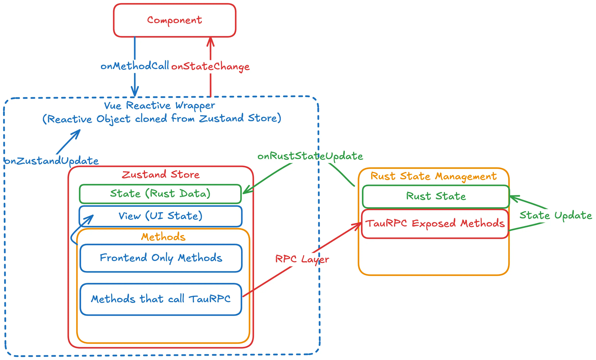

**Zustand** is a state management library used as our solution to synchronizing states between the backend (TauRPC & RabbitMQ) and the frontend (Vue.js). Everything discussed in the following sections will be primarily focused on the frontend side.

Currently, we are using this for [Map](../implementation/map-frontend), [Mission](../implementation/mission-frontend), and [Telemetry](../implementation/telemetry-frontend). Check out the respective pages for documentation on the state management for vehicle missions and vehicle telemetry.

The following diagram provides an overview of how state management works on the frontend.



## How it Works

To use Zustand, we must create a **store**. A store is an object that contains the state and methods for the application. This store is a centralized place to store states and logic. Whenever states update in the Tauri Rust backend, the store will also update with the new states. The Vue frontend then can read from these states after the update, ensuring synchronized data between the backend and the frontend.

One thing to note is that stores *can* communicate with each other. If the data-flow of one API is similar or related to another API's, then we can utilize multiple stores to achieve a task. We'll explain this with an example using the Map Store and Mission Store.

For some quick context, we use a map to designate zones for the vehicle's area of operations.


The Map Store is strictly responsible for updating the zones visually, so it is not responsible for updating the data of the zonse. To do the latter, we use the methods in the Mission Store to update the zones data to our Rust backend. Hence, there is a layer of abstraction where methods from one store are being called by methods in another store.

[Matthew can elaborate more on this]

## Creating a Store

This guide will assume there is already a backend API set up. At the very least, a `types.rs` file (which you can find under `src-tauri/src/[api name]`). For examples of stores, please refer to the **Implementation** section in the sidebar.

Fair warning, stores can be a bit tricky to figure out! Do not hesistate to ask the UI team for help!

### Initialization

First, create a store file called `[store name].ts` file under `src/components/lib`. We'll need to import some dependencies.

```typescript
import { createStore } from "zustand/vanilla"; // #1
import { DeepReadonly, reactive } from "vue"; // #2
import { createTauRPCProxy, ExampleStruct } from "@/lib/bindings"; // #3
import { ExampleStore } from "@/lib/MissionStore.types"; // #4
```

**#1** is for the createStore function.

**#2** is used in a workaround to make Zustand reactive. Refer to [A Pitfall of Zustand](#a-pitfall-of-zustand).

**#3** is for initializing the store.  
- `createTauRPCProxy` is a function that creates a proxy for **TauRPC**, our backend Tauri API library. This allows the frontend to easily call backend functions as if they were local functions through a TypeScript API, while abstracting away the **remote procedure call (RPC)** details.  
- `ExampleStruct` is the struct being used to store states in the API. Refer to the associated `types.rs` file to figure out which structs to import.  

**#4** is the interface of your store. Refer to [Typing](#typing).

Right after the imports, we will use the following two lines to initialize the TauRPC proxy and the initial state of our store.

```typescript
// Create TauRPC proxy
const taurpc = createTauRPCProxy();

// Fetch initial state from backend
const initialState: ExamplesStruct = await taurpc.example.get_all_examples();
```

For initial state, there is usually an exposed function from the backend that will fetch all necessary states for your store/struct. Notice how the `get_all_examples()` function is being accessed via the `taurpc` const.

Now the store can be created.

```typescript
export const exampleZustandStore = createStore<ExampleStore>((set, get) => ({
  state: initialState

  syncRustState: (rustState: ExamplesStruct) => {
    set(
      () =>
        ({
          state: rustState
        }) satisfies Partial<ExampleStore> // Satisfies a portion of the store interface
    );
  },
}));
```

The first couple lines of the store const will be necessary for the next section, [Backend Listeners](#backend-listeners). These lines will set the store's state via a `set()` function with the rustState object, ensuring synchronization with the backend Rust state. The `Partial` type needs to be assigned to the interface since only a *partial* of the interface's properties gets updated (in this case, `state`), otherwise it will give a type error.

For the `createStore()` function, we are passing in the store's interface and two parameters-- **set** and **get**. Set is for setters, get is for getters. Pass in whichever will be used. Past this chunk of code, write out the methods that will be used in this store.

### Methods

There are typically three types of methods that can be used in each store:

- Setters - Updates the local UI state. Requires `set` to be passed into `createStore()`.
- Getters - Fetches data from the backend. Requires `get` to be passed into `createStore()`.
- TauRPC - Calls asynchronous backend procedures to modify a state.

<!-- <ins> element is for underlining -->
Here are some examples of each method type provided by our Mission Store. Do note that the actual implementation can heavily vary between stores. <ins>This is simply to give an idea of how it works, not a strict template for writing methods.</ins>

```typescript
export const exampleZustandStore = createStore<ExampleStore>((set, get) => ({
  state: initialState

  syncRustState: (rustState: ExamplesStruct) => {...
  },

  // Example of a setter method
  setCurrentView: (view: ViewType) => {
    set((state) => ({
      view: {
        ...state.view, // Spread the existing view state to retain other properties
        currentView: view
      } satisfies ViewState // Satisfies the ViewState type
    }));
  },

  // Example of a getter method
  getMissionData: (missionId: number) =>
    get().state.missions.find((mission) => mission.mission_id === missionId),

  // Example of a TauRPC method
  startMission: async (missionId: number) => {
    return await taurpc.mission.start_mission(missionId);
  },
}));
```

### Backend Listeners

To retrieve data from TauRPC, we'll need to set up these two listeners.

**IMPORTANT**: Never use `.setState()` directly as to modify the state property it can cause desync issues. Instead, use `.syncRustState()`.

```typescript
import {
  createTauRPCProxy,
  ExampleStruct
} from "@/lib/bindings";

// On initial page load, fetch the example data from the backend
taurpc.example.get_all_examples().then((data) => {
  console.log("Example data fetched:", data);
  exampleZustandStore.getState().syncRustState(data);
});

// On example data update from backend, update the store
taurpc.example.on_updated.on((data: exampleStruct) => {
  console.log("Example data updated:", data);
  exampleZustandStore.getState().syncRustState(data);
});
```

In tandem with the `get_all_examples()` method mentioned earlier, the store will get the state of itself with `getState()` and synchronize the data pulled from the TauRPC backend with `syncRustState(data)`.

Whenever the TauRPC data is updated, the store will also update its state via `.on_updated.on()`

### Subscribing

At the bottom, we set up a subscription to listen for state changes so the store stays up-to-date.

```typescript
exampleZustandStore.subscribe((newState) => {
  Object.assign(exampleStore, newState);
  console.log('Example Zustand Store updated', exampleStore);
});
```

With the `.subscribe()` method, Zustand is listening for any changes to the state. When a change is found, it assigns the new state into the store.

Lastly, we'll need this line at the bottom. This will be explained in [A Pitfall of Zustand](#a-pitfall-of-zustand).

```typescript
export const exampleStore: DeepReadonly<ExampleStore> =
  reactive(exampleZustandStore.getState());
```

### Typing

As per usual with TypeScript, we need to define the types and interfaces used in our store. Make a `.types.ts` file for the store, located in the same directory.

Main takeaway is to export an interface of the store, with type definitions for each method used. We'll also need to define the type of the backend state used in the Store.

```typescript
export interface ExampleStore {
  state: ExampleStruct;
  syncRustState: (state: ExampleStruct) => void;
  ...
}
```

## A Pitfall of Zustand

Zustand is an attractive framework-agnostic solution to centralized APIs between backend and frontend due to it being lightweight, fast, and scalable, but only after implementation did we realize why it was not used for Vue applications.

Our frontend framework, Vue, is **_reactive_**, meaning the UI automatically updates when the state changes. Unfortunately, Zustand is _not reactive_. Since it was too late to go back on the implementation, we need to use a workaround.

### Workaround

At the very bottom of each store, we will include this code:

```typescript
import { DeepReadonly, reactive } from "vue";
import { ExampleStore } from "@/lib/MissionStore.types"; // Interface of the store

export const exampleStore: DeepReadonly<ExampleStore> = 
  reactive(exampleZustandStore.getState());
```

We are recreating and then exporting the store by wrapping the store's current state with Vue's Reactive object. With this wrap, we allow components to automatically rerender on changes to the store. The `DeepReadonly` type will make all properties read-only to prevent desync and accidental changes to the state.

There is one more thing that needs to be added to whatever Vue component we are using the store in. We'll be using `MapSidebar.vue` component as an example. This component will read states from `MissionStore.ts`.

```vue
<script>
  import { computed } from "vue";
  import { missionStore } from "@/lib/MissionStore";

  const stateUpdate = computed((prev: boolean | undefined) => {
    // Read from missionStore.state as a dependency
    missionStore.state;
    // Return a boolean value that switches between true and false
    return !prev;
  });
</script>

<template>
  <!-- Trigger rerender with stateUpdate boolean -->
  <Sidebar :key="String(stateUpdate)" side="right">
    ...
</template>
```

Whenever `missionStore.state` is updated, the `stateUpdate` constant will read the state value and return a boolean. This boolean simply switches between true and false, which will toggle the Sidebar off/on, thus causing Vue to rerender the component with the updated state values.

In the future, we hope to find other solutions for state management-- possibly standalone Vue state management systems such as [Pinia](https://pinia.vuejs.org/).
