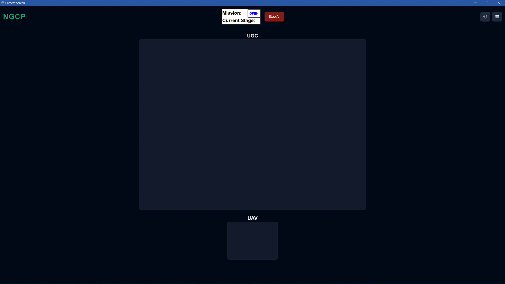

The `Cameras.vue` component is used to display camera feed provided by the [FPV camera server](../../embedding-external-binaries/fpv-camera-server).

This component uses the [Card](https://www.shadcn-vue.com/docs/components/card.html), [Carousel](https://www.shadcn-vue.com/docs/components/carousel.html), and [Skeleton](https://www.shadcn-vue.com/docs/components/skeleton.html) components from [shadcn/vue](https://www.shadcn-vue.com/docs/introduction.html).

## Features

- 4:3 aspect ratio camera views which fit the actual camera resolutions.
- Placeholder skeleton for cameras if there is no feed (aka the camera server is not running).
- [Two camera layouts](#camera-layouts).

### Camera Layouts

#### Carousel

Heavily inspired by Discord's call layout.  
Click the small camera or **thumbnail** to switch places with the enlarged camera.

[Camera Off Preview](#carousel-camera-off) | [Camera On Preview](#carousel-camera-on)

#### Side-by-side

Click the enlarged camera to switch layouts.

[Camera Off Preview](#side-by-side-camera-off) | [Camera On Preview](#side-by-side-camera-on)

#### Implementation

The styling isn't particularly great but it gets the job done.

Both layouts exist at once, but are rendered based on a v-if statement. The string reference `layout.value` will store which layout is currently selected.

The FPV camera server repeatedly outputs an image, so we use an `img` tag to display the camera. If the server is offline (if `v-if="feed.src"` is false), a Skeleton component takes up the space where the camera feed should be.

```js
// src/components/Cameras.vue
<!-- Side-by-Side (Grid) Layout -->
<div class="grid-container" v-if="layout === 'grid'"> // Vue conditional for rendering side-by-side layout
  <div v-for="feed in cameraFeeds" :key="feed.id">
    <div class="camera">
      <p class="text-center text-xl font-semibold">{{ feed.name }}</p>
      <Card class="cursor-pointer" @click="toggleLayout"> // Click event handler for the cameras
        <CardContent class="flex p-0">
          <Skeleton class="aspect-[4/3] w-full" v-if="!feed.src" /> // If there is no feed, the Skeleton component fills up the empty camera space
           // Camera feed
        </CardContent>
      </Card>
    </div>
  </div>
</div>

<!-- Carousel Layout -->
<div class="carousel-container" v-else-if="layout === 'carousel'"> // Vue conditional for rendering carousel layout
  <Carousel class="p-5" @init-api="(val) => (emblaMainApi = val)" :plugins="[Fade()]">
    <CarouselContent>
      <CarouselItem v-for="feed in cameraFeeds" :key="feed.id">
        <div class="focused-camera">
          <p class="text-center text-xl font-semibold">{{ feed.name }}</p>
          <Card class="cursor-pointer" @click="toggleLayout"> // Click event handler for the focused camera
            <CardContent class="flex p-0">
              <Skeleton class="aspect-[4/3] w-full" v-if="!feed.src" /> // If there is no feed, the Skeleton component fills up the empty camera space
               // Camera feed
            </CardContent>
          </Card>
        </div>
      </CarouselItem>
    </CarouselContent>
  </Carousel>
  ...
```

This is the function triggered by the click event.

```js
// src/components/Cameras.vue
const toggleLayout = () => {
  if (layout.value === 'grid') {
    cleanupCarousels();
    layout.value = 'carousel';
  } else {
    layout.value = 'grid';
  }
};
```

`cleanupCarousels()` simply resets the carousel/emblaAPI everytime we switch layouts, so that the camera switching functions properly.

## Gallery

### Demo Day

Screenshot of MRA taking flight.  
ERU camera is off, hence the static.


### Carousel (Camera Off)

_Note that the actual vehicle names should be ERU and MRA._



### Side-by-Side (Camera Off)

_Note that the actual vehicle names should be ERU and MRA._


### Carousel (Camera On)

_Note that the actual vehicle names should be ERU and MRA._


### Side-by-Side (Camera On)

_Note that the actual vehicle names should be ERU and MRA._


