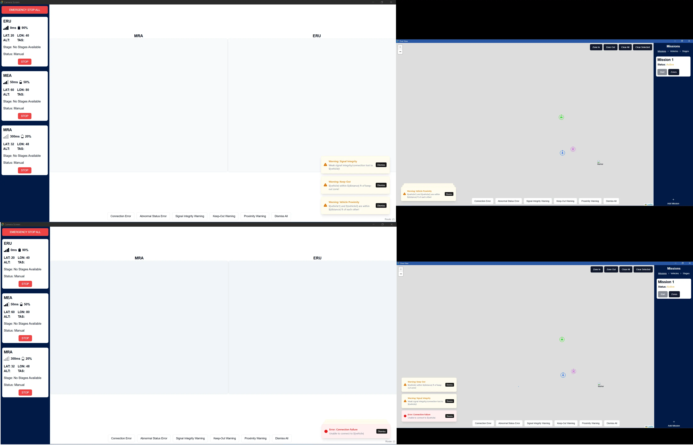

import { Aside } from '@astrojs/starlight/components';

The `AlertToast.vue` component is used to display [errors and warnings](#errors-and-warnings) generated by abnormal vehicle or mission statuses.

This component uses the [Button](https://www.shadcn-vue.com/docs/components/button.html) and [Sonner](https://www.shadcn-vue.com/docs/components/sonner.html) components from [shadcn/vue](https://www.shadcn-vue.com/docs/introduction.html).

## Features
- [Toasts sync between screens](#toast-synchronization).
- [Toasts position themselves based on the current screen](#toast-positioning).
- Toasts don't [expire](#toast-expiration) nor have a [limit](#toast-limit).
- [Backend Integration](#backend-integration).
- Row of placeholder buttons to generate/test toasts.


### Toast Synchronization

Because we have two application windows or screens, we need a way to synchronize the toasts and interactions between them. The system uses Tauri listeners/emitters to ensure alerts appear consistently across all windows.

As mentioned earlier, these toasts do not persist on page refreshes. If you refresh one screen/page, the toasts will be out of sync.

#### Event System

First, we set up the listeners for each event: creating toast, dismissing toast, and dismissing all toasts.

When creating the toast, we create a Dismiss button under the `action` property.

Do note that Dismiss All is emitted by a test button, as opposed to a button that is located on the toast itself like the regular Dismiss.

The AlertToast.vue component listens for three events:


```js
// src/components/AlertToast.vue
listen("create-toast", (event) => {
  const { id, type, title, description } = event.payload as {
    id: string;
    type: "error" | "warning" | "info";
    title: string;
    description: string;
  };

  toast[type](title, {
    id,
    description,
    duration: Infinity,
    action: { label: "Dismiss", onClick: () => emit("dismiss-toast", { id }) }
  });
});

listen("dismiss-toast", (event) => {
  const { id } = event.payload as { id: string };
  toast.dismiss(id);
  console.log(`Alert cleared: ${id}`);
});

listen("dismiss-all-toasts", () => {
  toast.dismiss();
  console.log(`All toast cleared`);
});
```

Lastly, setup the test buttons to emit the events. Here's one button as an example.

```vue
// src/components/AlertToast.vue
<Button
      variant="outline"
      @click="
        () => {
          emit('create-toast', {
            id: 'test_connection_error',
            type: 'error',
            title: 'Error: Connection Failure',
            description: 'Unable to connect to ERU (test)'
          });
        }
      "
    >
  Connection Error
</Button>
```


### Toast Positioning

We do not want the toasts to cover the sidebars, which contain critical information. Thus, we position the `AlertToast` component based on which screen it is.

On the `Camera Screen`, the toasts will be positioned at the bottom-right. On the `Over View` screen, the toasts will be positioned at the bottom-left.

In the toast component, we retrieve the route and then set `toasterPosition` as the result of the computation.

```js
// src/components/AlertToast.vue
const route = useRoute();

const toasterPosition = computed(() => {
  return route.path === "/" ? "bottom-right" : "bottom-left"; // '/' is the route of Camera Screen
});
```

Then under `<template>`, add the position property.

```js
// src/components/AlertToast.vue
<template>
  <Toaster richColors :position="toasterPosition" />
  ...
```

If you also want to know the routes of each screen, go to the respective view and add this:

```js
// src/views/TestScreen.vue
import { useRoute } from 'vue-router'

const route = useRoute()

...

<template>
  <div class="text-xs text-gray-500 fixed bottom-2 right-2 z-50">
    Route: {{ route.name }} ({{ route.path }})
  </div>
  ...
```

### Toast Expiration

By default, the Sonner component has a set expiration and limit for the toasts. We can adjust this in the following ways.

Under an event listener that creates a toast, we set the `duration` property to `Infinity`.

```ts
// src/components/AlertToast.vue

listen("create-toast", (event) => {
  ...

  const toastId = toast[type](title, {
    id,
    description,
    duration: Infinity, // Set duration to infinity
    action: { label: "Dismiss", onClick: () => emit("dismiss-toast", { id }) }
  });

  ...
});
```

Alternatively, we simply set the `TOAST_REMOVE_DELAY` to a high number. The number is in seconds.

```ts
// src/components/ui/toast/use-toast.ts
const TOAST_REMOVE_DELAY = 1000000
```

You might be able to get away with removing `TOAST_REMOVE_DELAY` instead of having both ways to remove toast expiration, but this has not been tested yet.

### Toast Limit

To remove the toast limit, simply comment out this line:

```ts
// src/components/ui/toast/use-toast.ts
const TOAST_LIMIT = 5
```

If you want to restore this limit, you need to slice the list of toasts stored in the state by adding `.slice(0, TOAST_LIMIT)`.

```ts
// src/components/ui/toast/use-toast.ts
function dispatch(action: Action) {
  switch (action.type) {
    case actionTypes.ADD_TOAST:
      state.value.toasts = [action.toast, ...state.value.toasts].slice(0, TOAST_LIMIT) // Add this
      break
      
      ...
```

## Errors and Warnings

Here is the list of Errors or Warnings that can be generated.

- **Error: Connection Failure**  
Unable to connect to [vehicle]
- **Error: Abnormal Status**  
Abnormal [vehicle] status (low battery, system error/failure)!
- **Warning: Signal Integrity**  
Weak signal integrity/connection lost to [vehicle]!
- **Warning: Keep-Out**  
[Vehicle] within [distance] ft of keep-out zone!
- **Warning: Vehicle Proximity**  
[Vehicle 1] and [Vehicle 2] are within [distance] ft of each other!

## Backend Integration

The alert system is fully integrated with the backend through a reactive monitoring architecture. When telemetry data is received from RabbitMQ and processed by the Rust backend, it flows through TauRPC to update the `TelemetryStore` (Pinia). 
The `StoresSync` module subscribes to telemetry state changes and triggers the `checkAlerts()` function from the `alertMonitoring` module on every update. 
This module evaluates all vehicle conditions against configured thresholds and emits Tauri events `(create-toast, dismiss-toast)` when alerts are triggered or resolved.
The AlertToast.vue component listens for these events and displays the corresponding toasts. 

### Alert Monitoring Module

The `src/lib/alertMonitoring.ts` module contains all alert detection logic:

#### Configurable Thresholds

```typescript
// src/lib/alertMonitoring.ts
export const ALERT_THRESHOLDS = {
  SIGNAL_STRENGTH: -70,    // dBm
  LOW_BATTERY: 20,         // percent
  PROXIMITY: 100,          // feet
};
```

Adjust these values to change alert sensitivity.

#### Debouncing Configuration

```typescript
// src/lib/alertMonitoring.ts
const ALERT_UPDATE_DEBOUNCE = 3000; // 3 seconds
```

This prevents excessive toast updates for the same alert. If a condition persists, the alert will update every 3 seconds with the latest data.
Increase/decrease this value to adjust update frequency 

#### Example: Signal Strength Alert

```typescript
// src/lib/alertMonitoring.ts
const checkSignalStrength = (vehicle: string, signalStrength: number): void => {
  if (signalStrength < ALERT_THRESHOLDS.SIGNAL_STRENGTH) {
    emitAlert(
      vehicle,
      "signal_strength",
      "warning",
      "Warning: Signal Integrity",
      `Weak signal integrity/connection lost to ${vehicle}!`
    );
  } else {
    clearAlert(vehicle, "signal_strength");
  }
};
```

### Alert Detection Flow

1. **Telemetry Update**: Backend receives new telemetry data from RabbitMQ
2. **Store Update**: TauRPC emits `on_updated` event → TelemetryStore syncs
3. **Subscription Trigger**: StoresSync detects telemetry state change
4. **Condition Check**: `alertMonitoring.checkAlerts()` evaluates all conditions
5. **Alert Emission**: If condition met → emit `create-toast` event
6. **Toast Display**: AlertToast.vue receives event → displays toast


### Integration with StoresSync

In `src/lib/StoresSync.ts`, the telemetry store is monitored for changes:

```typescript
// src/lib/StoresSync.ts
import { checkAlerts } from "./alertMonitoring";

export const establishTaurpcConnection = () => {
  // ... existing setup ...
  
  telemetryStore = telemetryPiniaStore();
  
  // Subscribe to telemetry changes and check for alerts
  telemetryStore.$subscribe((mutation, state) => {
    checkAlerts(state.telemetryState);
  });
};
```

### Alert Deduplication and Updates

#### Key-Based System

Each alert has a unique key generated from the vehicle and alert type:

```typescript
// src/components/AlertToast.vue
const getAlertKey = (vehicle: string, type: string): string => {
  return `${vehicle}_${type}`;  // e.g., "ERU_signal_strength"
};
```

This key serves two purposes:
1. **Deduplication**: Prevents multiple toasts for the same condition
2. **Toast ID**: Used by vue-sonner to update existing toasts

#### How Vue-Sonner Handles Updates

When an alert is emitted with the same ID as an existing toast:
- Vue-sonner **updates** the existing toast in-place
- The toast does **not** disappear and reappear
- Content smoothly transitions to the new description

#### Important Behavior

If a user manually dismisses a toast using the "Dismiss" button, but the underlying condition still exists:
- The toast will **reappear** on the next telemetry update (after debounce period)
- This is intentional - alerts represent real conditions that need attention
- To permanently dismiss: **resolve the underlying condition** (e.g., improve signal strength)


## Gallery

