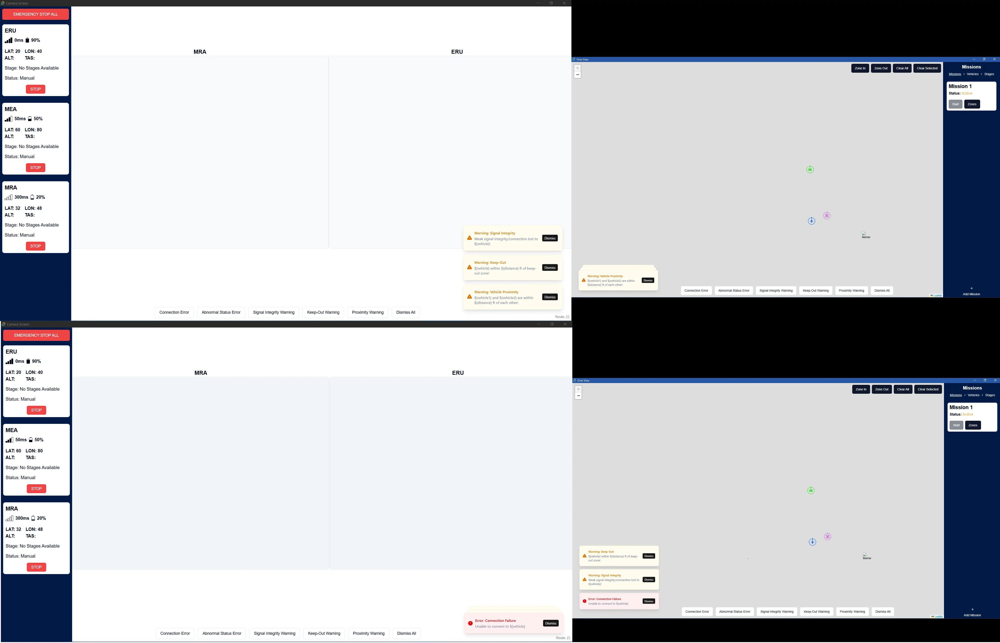

import { Aside } from '@astrojs/starlight/components';

The `AlertToast.vue` component displays [errors and warnings](#errors-and-warnings) generated by abnormal vehicle or mission statuses. It is a custom toast stack built with Vue and CSS — it does not depend on vue-sonner or any third-party toast library.

A separate `AlertTestButtons.vue` component provides placeholder buttons for generating and testing toasts during development.

## Features

- **Stacking**: Toasts collapse into a compact stack and fan out on hover.
- **Priority ordering**: Error toasts always appear at the front of the stack; warnings sit behind them.
- **Dismiss cooldown**: Error toast dismiss buttons are disabled for 3 seconds after appearing, with a visible countdown.
- **Synchronization**: [Toasts sync between screens](#toast-synchronization) via Tauri events.
- **Positioning**: [Toasts position themselves](#toast-positioning) based on the current screen.
- **No expiration or limit**: Toasts persist until explicitly dismissed or the underlying condition clears.
- **[Backend integration](#backend-integration)**: Alert conditions are evaluated from live telemetry data.

## Component Architecture

The alert system is split into two components:

- **`AlertToast.vue`** — Listens for Tauri events, manages toast state, renders the toast stack. Contains no test UI.
- **`AlertTestButtons.vue`** — A development-only component with buttons that emit toast events for testing. Import it in `App.vue` during development and remove it before shipping.

```vue
<!-- src/App.vue -->
<template>
  <AlertToast />
  <AlertTestButtons />  <!-- Remove before production -->
  <div class="flex h-[100dvh] flex-col">
    <SidebarProvider class="min-h-0 flex-grow overflow-y-hidden">
      <RouterView />
    </SidebarProvider>
  </div>
</template>
```

## Toast Stack Behavior

### Collapsed State

When not hovered, toasts collapse into a compact stack anchored to the bottom of the viewport. The front toast (always the highest-priority error) is fully visible. Up to `VISIBLE_COLLAPSED` (default: 3) toasts peek behind the front toast with slight vertical offsets and scale reduction. Toasts beyond this limit are fully hidden.

### Expanded State

On hover, the stack fans out upward. All toasts become fully visible with equal spacing. Each non-front toast is translated upward using a calculated pixel offset based on `TOAST_HEIGHT_ESTIMATE` (72px) and `TOAST_GAP` (8px).

### Priority Ordering

The `sortedToasts` computed property sorts warnings before errors in the array. Combined with the `getStackIndex` function, this places errors at stack-index 0 (the front) and warnings further back. Errors are always the most prominent and visible toasts.

```ts
// Warnings sort first (back of stack), errors sort last (front of stack)
const sortedToasts = computed(() => {
  return Object.values(activeToasts.value).sort((a, b) => {
    const priority = (type: string): number => (type === "error" ? 1 : 0);
    return priority(a.type) - priority(b.type);
  });
});
```

### Dismiss Cooldown

Error toasts have a 3-second cooldown before they can be dismissed. The dismiss button displays a countdown — `Dismiss (3)` → `Dismiss (2)` → `Dismiss (1)` → `Dismiss` — and is greyed out and disabled until the countdown completes. Warning and info toasts can be dismissed immediately.

The cooldown uses per-toast `setTimeout` chains rather than a global polling interval. This avoids triggering component-wide re-renders that would cause `TransitionGroup` to replay enter animations.

```ts
const startCooldown = (id: string): void => {
  disabledToasts[id] = 3;

  const tick = (remaining: number) => {
    if (remaining <= 0) {
      delete disabledToasts[id];
      return;
    }
    disabledToasts[id] = remaining;
    setTimeout(() => tick(remaining - 1), 1000);
  };

  setTimeout(() => tick(2), 1000);
};
```

## Toast Synchronization

Because the application has two windows/screens, the toast system uses Tauri event listeners and emitters to synchronize alerts across all windows. If one screen is refreshed, toasts on that screen will be out of sync until new telemetry triggers them again.

### Event System

The component listens for three events:

```ts
// src/components/AlertToast.vue

listen("create-toast", (event) => {
  const payload = event.payload as ToastData;
  addOrUpdateToast(payload);
});

listen("dismiss-toast", (event) => {
  const { id } = event.payload as { id: string };
  removeToast(id);
});

listen("dismiss-all-toasts", () => {
  clearAll();
});
```

The test buttons component emits these same events. Here is one button as an example:

```vue
<!-- src/components/AlertTestButtons.vue -->
<Button
  variant="outline"
  @click="
    emit('create-toast', {
      id: 'test_connection_error',
      type: 'error',
      title: 'Error: Connection Failure',
      description: 'Unable to connect to ERU (test)',
    })
  "
>
  Connection Error
</Button>
```

## Toast Positioning

Toasts are positioned to avoid covering sidebars that contain critical information. On the **Camera Screen** (`/`), toasts appear at the bottom-right. On the **Overview Screen**, they appear at the bottom-left.

```ts
// src/components/AlertToast.vue
const route = useRoute();
const isRight = computed(() => route.path === "/");
```

The computed value drives a class binding on the stack container:

```vue
:class="[
  'toast-stack',
  isRight ? 'toast-stack--right' : 'toast-stack--left',
  { 'toast-stack--expanded': isHovered },
]"
```

To verify routes during development, add this to any view:

```vue
<!-- src/views/TestScreen.vue -->
<div class="text-xs text-gray-500 fixed bottom-2 right-2 z-50">
  Route: {{ route.name }} ({{ route.path }})
</div>
```

## Toast Styling

Toasts are color-coded by type:

- **Error**: Red 
- **Warning**: Yellow  
- **Info**: Blue  

Each toast includes an SVG icon matching its type (circle-x for errors, triangle-alert for warnings, circle-info for info).

### CSS Architecture Notes

The stack avoids `position` switching between `absolute` and `relative` on hover, as that causes layout reflows that `TransitionGroup` misinterprets as movement, re-triggering enter animations. Instead, non-front toasts are `position: absolute` at all times, and the expand/collapse effect is achieved purely through `transform: translateY()` changes, which are GPU-composited and reflow-free.

The front toast (stack-index 0) remains `position: relative` so the stage container has an intrinsic height.

## Errors and Warnings

Here is the list of errors and warnings that can be generated:

- **Error: Connection Failure** — Unable to connect to [vehicle]
- **Error: Abnormal Status** — Abnormal [vehicle] status (low battery, system error/failure)!
- **Warning: Signal Integrity** — Weak signal integrity/connection lost to [vehicle]!
- **Warning: Keep-Out** — [Vehicle] within [distance] ft of keep-out zone!
- **Warning: Vehicle Proximity** — [Vehicle 1] and [Vehicle 2] are within [distance] ft of each other!

## Backend Integration

The alert system is integrated with the backend through a reactive monitoring architecture. Telemetry data received from RabbitMQ is processed by the Rust backend, flows through TauRPC to update the `TelemetryStore` (Pinia), and is evaluated for alert conditions by the `alertMonitoring` module.

### Alert Detection Flow

1. **Telemetry Update**: Backend receives new telemetry data from RabbitMQ
2. **Store Update**: TauRPC emits `on_updated` event → TelemetryStore syncs
3. **Subscription Trigger**: StoresSync detects telemetry state change
4. **Condition Check**: `alertMonitoring.checkAlerts()` evaluates all conditions
5. **Alert Emission**: If condition met → emit `create-toast` event
6. **Toast Display**: AlertToast.vue receives event → displays toast

### Alert Monitoring Module

The `src/lib/alertMonitoring.ts` module contains all alert detection logic.

#### Configurable Thresholds

```ts
// src/lib/alertMonitoring.ts
export const ALERT_THRESHOLDS = {
  SIGNAL_STRENGTH: -70,    // dBm
  LOW_BATTERY: 20,         // percent
  PROXIMITY: 100,          // feet
};
```

Adjust these values to change alert sensitivity.

#### Debouncing Configuration

```ts
// src/lib/alertMonitoring.ts
const ALERT_UPDATE_DEBOUNCE = 3000; // 3 seconds
```

This prevents excessive toast updates for the same alert. If a condition persists, the alert will update every 3 seconds with the latest data. Increase or decrease this value to adjust update frequency.

#### Example: Signal Strength Alert

```ts
// src/lib/alertMonitoring.ts
const checkSignalStrength = (vehicle: string, signalStrength: number): void => {
  if (signalStrength < ALERT_THRESHOLDS.SIGNAL_STRENGTH) {
    emitAlert(
      vehicle,
      "signal_strength",
      "warning",
      "Warning: Signal Integrity",
      `Weak signal integrity/connection lost to ${vehicle}!`
    );
  } else {
    clearAlert(vehicle, "signal_strength");
  }
};
```

### Integration with StoresSync

In `src/lib/StoresSync.ts`, the telemetry store is monitored for changes:

```ts
// src/lib/StoresSync.ts
import { checkAlerts } from "./alertMonitoring";

export const establishTaurpcConnection = () => {
  // ... existing setup ...

  telemetryStore = telemetryPiniaStore();

  // Subscribe to telemetry changes and check for alerts
  telemetryStore.$subscribe((mutation, state) => {
    checkAlerts(state.telemetryState);
  });
};
```

### Alert Deduplication and Updates

#### Key-Based System

Each alert has a unique key generated from the vehicle and alert type:

```ts
// src/lib/alertMonitoring.ts
const getAlertKey = (vehicle: string, type: string): string => {
  return `${vehicle}_${type}`;  // e.g., "ERU_signal_strength"
};
```

This key serves as both the deduplication key and the toast ID. When `create-toast` is emitted with an ID that already exists in `activeToasts`, the existing toast is updated in place rather than creating a duplicate.

#### Important Behavior

If a user manually dismisses a toast, but the underlying condition still exists, the toast will reappear on the next telemetry update (after the debounce period). This is intentional — alerts represent real conditions that need attention. To permanently dismiss an alert, resolve the underlying condition (e.g., improve signal strength, recharge battery).

## Gallery

