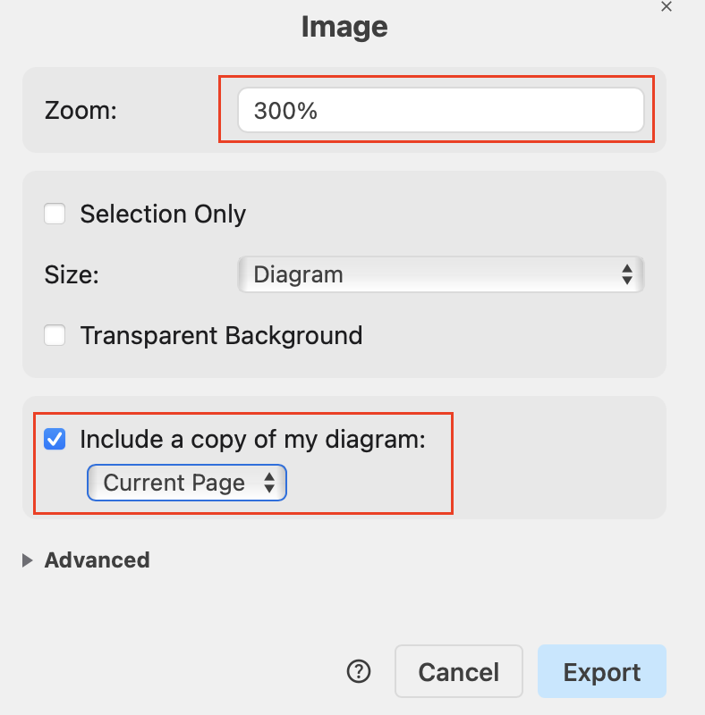

## Format of Documentation
The documentation is written in Markdown, where its syntax can be found here: [Markdown Guide](https://www.markdownguide.org/basic-syntax/).
The documentation is structured in a way that each section is a separate Markdown file, which can be found in the `src/content/docs` directory.
The different sub-team documentations can be found in their respective directories.
Each file should have a blurb at the top, which is used to generate the sidebar and the page title.

## How to Contribute
To contribute to the documentation, you can follow these steps:
1. Clone the repository to your local machine.
2. Navigate to the `src/content/docs` directory.
3. Create a new branch for your changes.
4. Create or edit the Markdown files as needed.
- Note, when creating a new file, make sure to include the blurb at the top of the file.
```
---
title: [Title here without brackets]
description: [Description here without brackets]
---
```

### Contributing Diagrams
We use [draw.io](https://www.drawio.com) to create our digrams.

#### Adding a new diagram
1. Exporting the diagram from draw.io
    - File -> Export as -> PNG
    - Zoom 300% (so it is not blurry)
    - Include copy of my diagram (ensures it is editable)
    - Modify other settings as needed



2. Add the exported diagram into the `public/diagrams` directory. Use subdirectories as needed (the public directory ensures it is downloadable).
3. Insert it into the documentation with `` in the md files. 

#### Editing Existing Diagrams
1. Downloading the diagram
    - Right click the target diagram
    - Download the image
2. Editing the Diagram in draw.io
    -  File -> Open from... -> Device -> select the downloaded diagram
3. Modify the diagram and export as shown above in **Adding a new diagram Step 1**
4. Replace the old file 